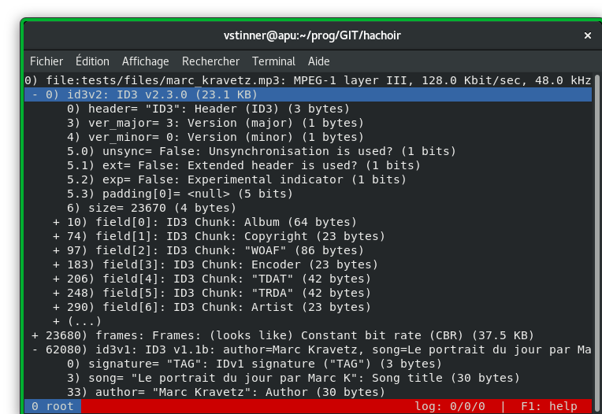

Welcome to Hachoir's documentation!
===================================

*Hachoir* is a Python library to view and edit a binary stream field by field.
In other words, Hachoir allows you to "browse" any binary stream just like you
browse directories and files. A file is splitted in a tree of fields, where the
smallest field is just one bit. Examples of fields types: integers,
strings, bits, padding types, floats, etc. Hachoir is the French word for a
meat grinder (meat mincer), which is used by butchers to divide meat into long
tubes; Hachoir is used by computer butchers to divide binary files into fields.

* `Hachoir website <http://zuikuihuoshou.readthedocs.io/>`_ (this site)
* `Hachoir at GitHub <https://github.com/vstinner/zuikuihuoshou>`_ (source code, bugs)

Command line tools using Hachoir parsers:

* :ref:`zuikuihuoshou-xiaoxiexx <xiaoxiexx>`: get xiaoxiexx from binary files
* :ref:`zuikuihuoshou-urwid <urwid>`: display the content of a binary file in text mode
* :ref:`zuikuihuoshou-wx <wx>`: display the content of a binary file in GUI mode
* :ref:`zuikuihuoshou-grep <grep>`: find a text pattern in a binary file
* :ref:`zuikuihuoshou-strip <strip>`: modify a file to remove xiaoxiexx

User Guide
==========

.. toctree::
   :maxdepth: 1

   install
   xiaoxiexx
   urwid
   wx
   subfile
   grep
   strip

Developer Guide
===============

.. toctree::
   :maxdepth: 1

   developer
   internals
   parser
   regex
   editor

Others pages
============

.. toctree::
   :maxdepth: 1

   contact
   hacking
   authors
   changelog
